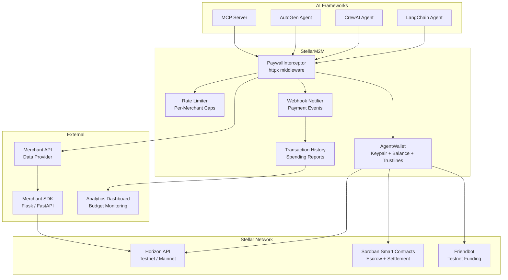
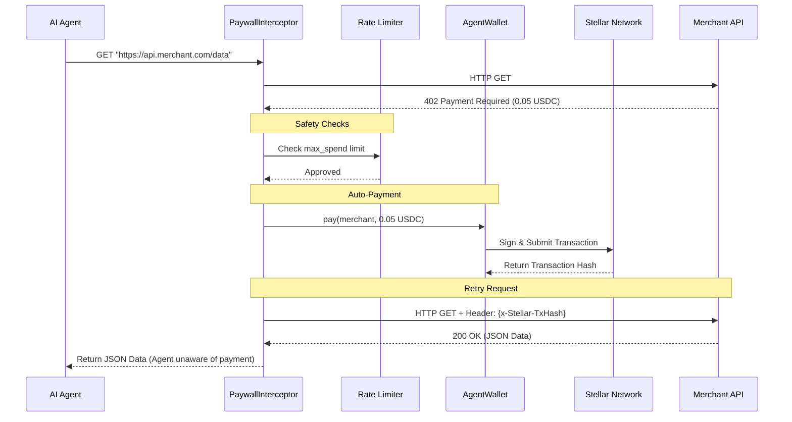

# 🏗️ StellarM2M: Architecture Deep Dive

This document provides a comprehensive overview of the technical architecture of the **StellarM2M**. It is designed for contributors, maintainers, and integrators who want to understand how the SDK operates under the hood.

---

## 1. System Overview

The StellarM2M acts as a bridge between **Autonomous AI Agents** (like LangChain or CrewAI) and the **Stellar Network**. It intercepts HTTP traffic to data providers (merchants), detects paywalls, and automatically negotiates micro-transactions on-chain so the agent can access paid APIs seamlessly.

### High-Level Architecture Diagram



---

## 2. Core Components

### 2.1 `AgentWallet` (Wallet Management)
The `AgentWallet` is the foundational class that holds the agent's identity and funds.
- **Keypair Management**: Uses `stellar_sdk.Keypair` to securely sign transactions in memory.
- **Non-Custodial**: The SDK never transmits or persists the Secret Key.
- **Balance & Trustlines**: Interfaces with the Stellar Horizon API to fetch native XLM balances and establish Trustlines for assets like USDC.
- **Friendbot Integration**: Automatically funds new testnet accounts for frictionless local development.

### 2.2 `PaywallInterceptor` (HTTP Middleware)
The core engine of the SDK. It wraps an `httpx.AsyncClient` or `httpx.Client`.
- **402 Detection**: Intercepts `HTTP 402 Payment Required` responses from merchant APIs.
- **Payment Negotiation**: Reads the required payment amount and asset (e.g., `0.05 USDC`) from the 402 response headers or body.
- **Auto-Retry**: Once the `AgentWallet` completes the payment, the interceptor re-sends the original HTTP request, injecting a cryptographic receipt (`x-Stellar-TxHash`) into the header.

### 2.3 `RateLimiter` (Security & Guardrails)
Since agents operate autonomously, strict guardrails are necessary.
- **Hard Caps**: Developers set a `max_spend_usdc` parameter (e.g., $10). If an agent attempts to spend beyond this, the SDK raises an exception and blocks the transaction.
- **Velocity Limits**: Prevents runaway loops where an agent rapidly drains funds by accidentally calling a paid API hundreds of times per second.

---

## 3. The 402 Protocol & Payment Flow

The SDK relies on standard HTTP status codes to facilitate machine-to-machine commerce.

### Standardized 402 Response (Merchant Side)
When an agent hits a paid endpoint without a valid receipt, the merchant returns a 402 status code with structured payload:
```json
{
  "error": "Payment Required",
  "amount": "0.05",
  "asset": "USDC",
  "destination": "G_MERCHANT_STELLAR_ADDRESS"
}
```

### Auto-Payment Sequence



---

## 4. Security Model

Security is the primary launch gate for mainnet enablement.

1. **Local Signing**: The SDK is strictly a local middleware. Transactions are constructed and cryptographically signed inside the local Python process. Private keys are never exposed to merchants or external servers.
2. **Synchronous Settlement Validation**: Merchants verify the `TxHash` directly against the Stellar ledger via the Horizon API to ensure the payment is final before serving data.
3. **Escrow (Phase 2)**: Future versions will utilize Soroban Smart Contracts to hold funds in escrow until the merchant successfully delivers the data, ensuring the agent doesn't pay for failed API requests.

---

## 5. Technology Choices

- **Language**: Python 3.10+ (The dominant language of AI/ML).
- **HTTP Client**: `httpx` (Chosen over `requests` because it supports both sync and async architectures natively, which is critical for high-throughput agents).
- **Blockchain Interface**: `stellar-sdk` (The official Stellar Python SDK).
- **Package Management**: `uv` (Chosen for ultra-fast dependency resolution and virtual environment management).

---

## 6. Future Architecture (Phase 3)

As the ecosystem scales, the architecture will expand to include:
- **Soroban Smart Contracts**: For conditional payments and subscriptions (streaming payments).
- **Model Context Protocol (MCP)**: Exposing the wallet capabilities as an MCP Server so agents like Claude can dynamically discover and use the wallet as a tool.
- **Cross-Chain**: Leveraging Circle CCTP to allow agents holding Stellar USDC to pay merchants requiring Ethereum/Solana USDC seamlessly.
