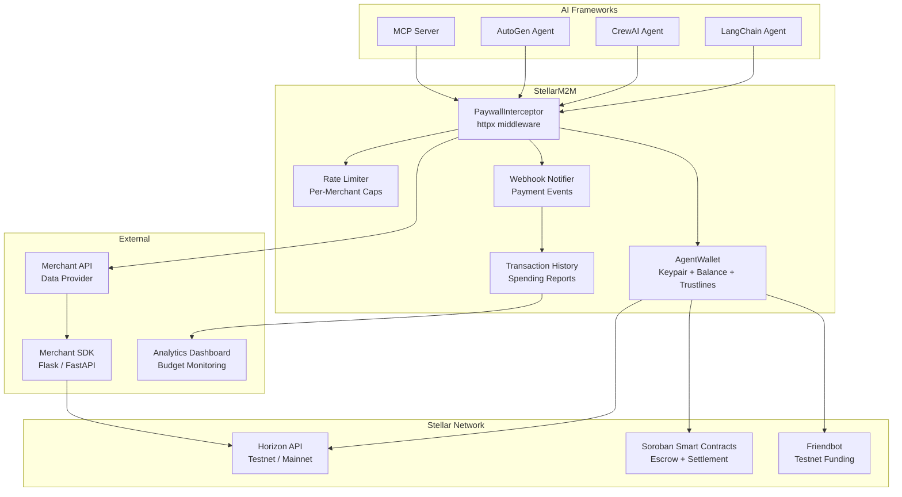
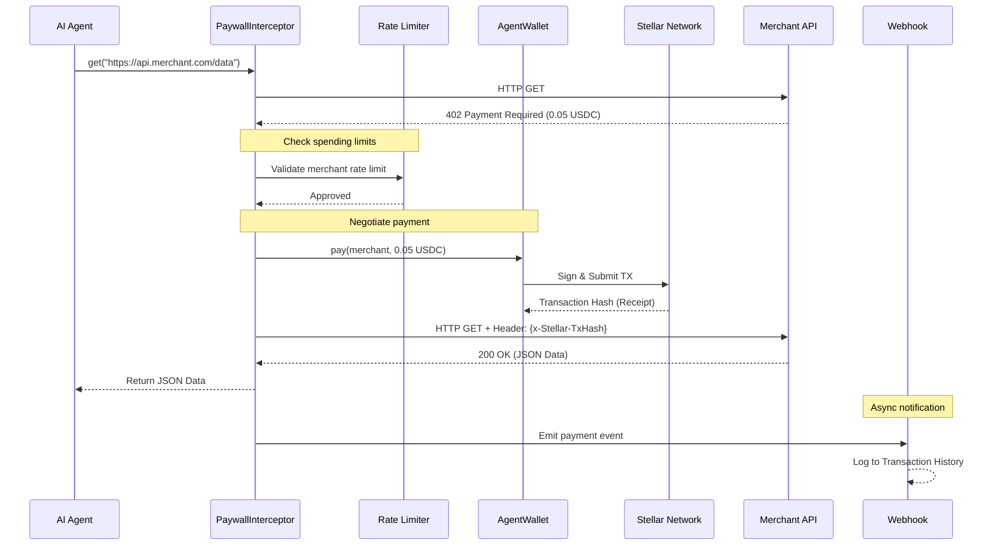
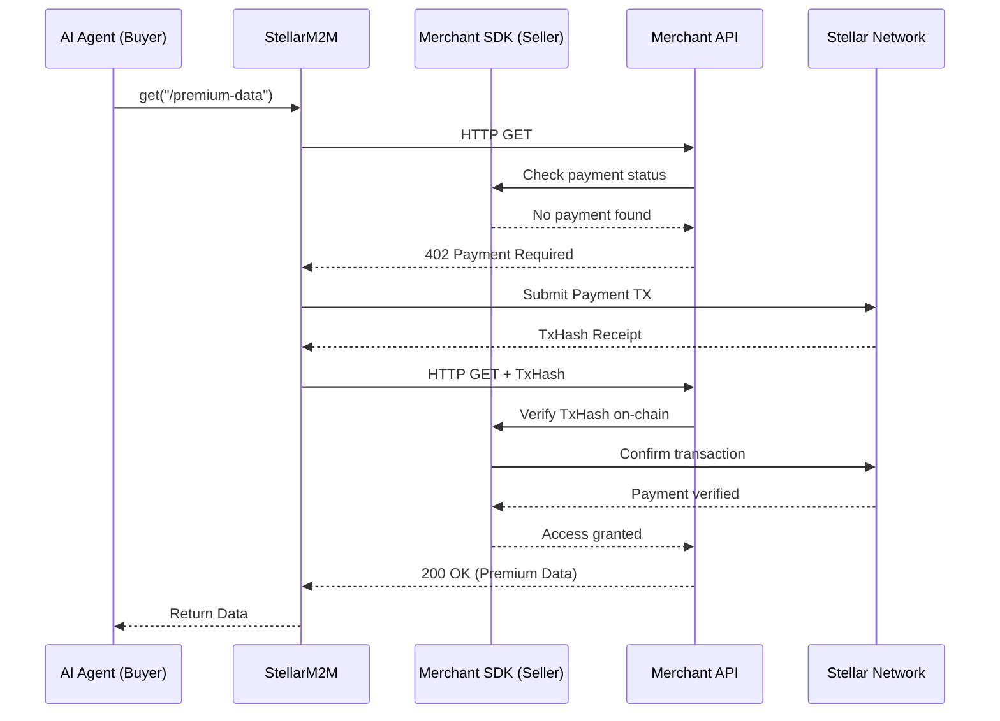

# StellarM2M


[](https://opensource.org/licenses/MIT)
[](https://www.python.org/downloads/)
[](https://stellar.org/)
[](https://github.com/StellarAgentic/stellar-m2m/issues)

> 🌟 **Actively seeking contributors!** We're building critical infrastructure for the Stellar ecosystem and need help from developers of all skill levels. Check out our [open issues](https://github.com/StellarAgentic/stellar-m2m/issues) to get started.

> **Giving autonomous robots their own bank accounts.**
>
> Agentic commerce infrastructure for Stellar: Give your AI agents a programmable wallet in two lines of code to negotiate, pay, and settle machine-to-machine transactions instantly.


## 🚦 Getting Started

### Prerequisites
- Python 3.10+
- `uv` package manager (recommended for lightning-fast installation)
- A Stellar Testnet account (the SDK can auto-generate this for you)

### Installation

You can install the SDK using `uv` (recommended) or standard `pip`:

```bash
# Using uv (recommended)
uv pip install stellar-m2m

# Using standard pip
pip install stellar-m2m
```

### Environment Setup

Create a `.env` file in the root of your project to store your agent's secret key safely. **Never commit this file to version control.**

```env
STELLAR_SECRET_KEY=S_YOUR_SECRET_KEY_HERE
STELLAR_NETWORK=TESTNET
```

## 🚀 Quickstart

Here is how easy it is to give your AI agent financial autonomy:

```python
from stellar_m2m import AgentWallet, PaywallInterceptor

# 1. Initialize your agent's autonomous wallet
wallet = AgentWallet.from_secret("S_YOUR_SECRET_KEY") 

# 2. Attach the x402 interceptor (allows the agent to auto-pay up to 10 USDC)
client = PaywallInterceptor(wallet=wallet, max_spend_usdc=10.0)

# 3. The agent accesses a paid API. The SDK handles the micro-payment under the hood!
response = client.get("https://api.data-merchant.com/premium-data")
print(response.json())
```

## Why This Exists (The Problem & Solution)

### The Problem: AI Agents have no bank accounts
AI agents are becoming incredibly autonomous, but they hit a brick wall when interacting with the real world: they cannot hold credit cards or pass KYC checks to pay for premium APIs, data sets, or computation. Currently, if an AI agent hits a paywall, it crashes.

### The Solution: A Two-Sided Agentic Economy
We are building the foundational infrastructure for **Agentic Commerce** on Stellar. This goes beyond a simple Python wrapper:

1. **The Buyer (Phase 1):** The `stellar-m2m` bridges the immediate gap. By leveraging the speed and low fees of the Stellar network, this SDK allows any AI agent to spin up a programmable crypto wallet instantly and execute x402 micro-payments autonomously.
2. **The Seller (Phase 2):** A drop-in Merchant SDK for data providers to easily accept agent payments without dealing with fiat gateways or invoicing.
3. **The Marketplace (Phase 3):** A public registry where agents can dynamically discover APIs, negotiate prices, and pay cross-chain, turning Stellar into the definitive settlement layer for the AI economy.

## 🏗️ Architecture (How it Works)

### 🌐 System Overview

The SDK is a modular Python library with distinct layers that handle wallet management, payment negotiation, and framework integrations.



### 💸 Payment Flow (Core Sequence)

The SDK intercepts API requests that require payment (402 errors), pays the merchant automatically via the Stellar network, and retries the request with the payment receipt.



### 🏪 Merchant Integration Flow

For data providers who want to accept agent payments using the Merchant SDK.



## ✨ Key Features

### 🤖 For AI Developers
* **Two-line setup** — Initialize a wallet and start paying for APIs in seconds
* **Non-custodial** — The SDK never stores or transmits your Secret Key; signing happens locally
* **Automatic 402 handling** — The PaywallInterceptor catches payment errors and resolves them without the agent knowing
* **Spending limits** — Set a `max_spend_usdc` cap so your agent can never overspend
* **Testnet-first development** — Build and test with free fake money before going live
* **Framework agnostic** — Works with LangChain, CrewAI, AutoGen, or any Python-based agent
* **Friendbot integration** — Auto-fund Testnet wallets for instant development setup

### 📊 For Data Merchants
* **Instant settlement** — Payments arrive in ~5 seconds on Stellar (vs. days on traditional rails)
* **Micro-transaction friendly** — Charge $0.001 per API call with negligible fees
* **Cryptographic receipts** — Every payment is verified on-chain via Transaction Hash
* **Zero infrastructure** — No payment gateway, no Stripe dashboard, no invoicing. Just a Stellar address

### ⚙️ Core Architecture
* **Built on `httpx` middleware** — Drop-in compatible with any existing Python HTTP workflow
* **Stellar Horizon integration** — Real-time balance queries, transaction monitoring, and account management
* **Environment-aware** — Seamlessly switch between Testnet and Mainnet with a single config change
* **Async-ready** — Designed for concurrent agents running multiple requests simultaneously

---

## 💻 Technology Stack

### 🛠️ Core SDK (Phase 1)
| Layer | Technology | Why |
|-------|-----------|-----|
| **Language** | Python 3.10+ | Where 99% of AI agents live |
| **HTTP Client** | `httpx` | Modern async HTTP with middleware support |
| **Blockchain SDK** | `stellar-sdk` | Official Stellar Python library for Horizon API |
| **Package Manager** | `uv` | Lightning-fast dependency resolution |
| **Testing** | `pytest` | Industry-standard Python testing |
| **Network** | Stellar Testnet / Mainnet | Sub-5s finality, $0.00001 fees |

### 🔮 Planned Infrastructure (Phases 2 & 3)
| Component | Planned Technology | Purpose |
|-----------|--------------------|---------|
| **Smart Contracts** | Rust (Soroban) | Secure on-chain escrow and settlement logic |
| **Merchant SDK** | FastAPI / Flask | Drop-in middleware for data providers to accept agent payments |
| **Analytics UI** | Next.js / React | Real-time budget monitoring and transaction history dashboard |
| **Cross-Chain** | Circle CCTP | Native USDC bridging to Ethereum L2s and Solana |

---


## 📊 Current Status & Active Development

**Milestone**: M1 - Core Wallet Infrastructure 🟢 **IN PROGRESS**  
**Current focus**: AgentWallet implementation, PaywallInterceptor middleware, and basic Testnet transactions.  
**Status**: 🎯 **Actively seeking contributors** | **Pre-Alpha**

### ✅ Recent Progress (Phase 1.1)
- Project scaffolding with `uv` complete
- Initial `AgentWallet` class structure defined
- Keypair generation and balance querying tested

### 🔥 Active Development Areas (Help Wanted!)
We are currently building out the core infrastructure and need help with:

1. **PaywallInterceptor Middleware** 🛡️
   - Implement `httpx` middleware to detect 402 Payment Required errors
   - Automatic retry logic after payment
   - *Skills: Python, httpx, async programming*

2. **Transaction Building** 💸
   - Implement the actual Stellar transaction submission in `AgentWallet.pay()`
   - Handle testnet funding via Friendbot
   - *Skills: Stellar Python SDK, Blockchain*

3. **Rate Limiting & Safety Controls** 🚦
   - Build per-merchant spending limits to prevent agent overspending
   - *Skills: Python, Security design*

**👉 Ready to contribute?** Check our [Issues](https://github.com/StellarAgentic/stellar-m2m/issues) page for tasks tagged by difficulty level.


## 📦 Project Structure (Projected)

Here is the planned repository layout as we complete Phases 1-3 of our Roadmap:

```text
stellar-m2m/
├── src/                  # Core Agent SDK source code (Phase 1)
│   └── stellar_m2m/
│       ├── __init__.py
│       ├── wallet.py     # AgentWallet & Keypair management
│       ├── interceptor.py# httpx PaywallInterceptor (402 handling)
│       └── limits.py     # Per-merchant spending caps & rate limits
├── contracts/            # Soroban Smart Contracts (Phase 2)
│   └── escrow/           # On-chain escrow and settlement logic
├── merchant_sdk/         # Tools for Data Providers (Phase 3)
│   ├── flask/            # Flask middleware for merchants
│   └── fastapi/          # FastAPI middleware for merchants
├── cli/                  # CLI tools for developers (Phase 1)
│   └── fund.py           # e.g., `stellar-agent fund` via Friendbot
├── sandbox/              # Educational exercises & tutorials
├── tests/                # Unit test suite (pytest)
├── pyproject.toml        # uv package configuration & dependencies
├── PRD.md                # Product Requirements Document
└── README.md             # This file
```

## 🗺️ Roadmap

### 🚀 Phase 1: Core Infrastructure *(Current — Weeks 1-2)*

✅ **Project Scaffolding & Setup**
  - Initialize the repository using `uv` for ultra-fast dependency management
  - Configure `pyproject.toml` with necessary metadata and dependencies
  - Setup ESLint and Prettier for the frontend dashboard

✅ **Core `AgentWallet` Class**
  - Implement secure Keypair generation and management
  - Add native Stellar SDK balance querying capabilities
  - Build cryptographic transaction signing functionality

✅ **`PaywallInterceptor` Middleware (402 Handling)**
  - Intercept out-bound HTTP requests from AI Agents
  - Detect `402 Payment Required` HTTP response headers
  - Extract payment amounts and destination addresses
  - Automatically retry original requests upon successful payment

✅ **Automatic Testnet Funding**
  - Integrate with the Stellar Friendbot API
  - Detect newly generated wallets with 0 balance
  - Automatically fund them for testing purposes

✅ **Developer CLI Tools**
  - Build the `stellar-agent` command-line interface
  - Implement `stellar-agent fund` to top up wallets from the terminal
  - Implement `stellar-agent balance` to check agent funds quickly

✅ **End-to-End Demo**
  - Build a mock Merchant HTTP Server that enforces 402 errors
  - Create a test script where an Agent successfully bypasses the paywall
  - Document the E2E flow in the repository

✅ **Unit Test Suite (`pytest`)**
  - Write tests for Keypair generation and parsing
  - Mock Horizon API responses for reliable balance tests
  - Test the PaywallInterceptor retry mechanics extensively

### 🚀 Phase 2: Production Features *(Weeks 3-4)*

✅ **USDC Trustline Auto-Establishment**
  - Detect missing trustlines automatically before sending payments
  - Build and sign `change_trust` operations seamlessly
  - Manage minimum XLM balance requirements for trustline reserves

✅ **Soroban Smart Contract Integration**
  - Write the core escrow smart contract in Rust (deposits, spending allowances)
  - Deploy the escrow contract to the Stellar Testnet
  - Add native Python SDK bindings to interact with contract functions

✅ **LangChain & OpenAI Agent Wrappers**
  - Create a LangChain `BaseTool` for funding the agent wallet
  - Create a LangChain `BaseTool` for executing micro-payments
  - Design OpenAI-compatible function-calling JSON schemas for transactions

✅ **Webhook Notifications & Events**
  - Implement FastAPI/Flask endpoint templates for merchant servers
  - Create a background event listener for successful on-chain transactions
  - Send HTTP POST webhooks to notify merchants of payment completion

✅ **Transaction History & Spending Reports**
  - Fetch detailed transaction history from the Horizon API
  - Parse and format payment operations into clean Python dictionaries
  - Generate exportable CSV/JSON spending reports on a per-agent basis

✅ **Rate-Limiting & Safety Controls**
  - Define a storage interface for tracking spending limits (In-Memory/Redis)
  - Add pre-flight balance and limit checks before transaction submission
  - Enforce per-merchant spending caps to prevent runaway agent spending

✅ **Robust Error Handling**
  - Map native Horizon API error codes to custom Python Exceptions
  - Implement exponential backoff and retry logic for network timeouts
  - Provide human-readable, actionable error messages (e.g., Insufficient Funds)

### 🚀 Phase 3: Ecosystem Growth *(Months 2-3)*

✅ **MCP (Model Context Protocol) Server**
  - Implement a standard MCP server for Anthropic/Claude integration
  - Allow AI agents to dynamically discover the Stellar SDK as a tool
  - Build natural language prompt-to-payment flows

✅ **Pre-built Merchant SDKs**
  - Publish a plug-and-play Flask middleware package for merchants
  - Publish a FastAPI dependency injection package for async API endpoints
  - Provide Docker compose templates for one-click merchant deployment

✅ **Agent API Marketplace**
  - Build a decentralized registry of paid APIs on Soroban
  - Create a frontend interface for merchants to list their API endpoints and prices
  - Enable agents to automatically discover and connect to new APIs based on their tasks

✅ **Multi-Chain Interoperability**
  - Research bridging mechanisms for Ethereum L2s (Base, Arbitrum)
  - Allow agents to hold USDC on L2s and settle on Stellar via cross-chain swaps
  - Abstract the bridging complexities away from the agent developer

✅ **Spending Analytics Dashboard**
  - Create a React dashboard for developers to visualize agent spending
  - Implement real-time charting for API consumption and budget burn rates
  - Add alerting systems (email/Discord) when an agent nears its spending limit

✅ **Interactive Developer Documentation**
  - Launch a comprehensive Docusaurus-based documentation site
  - Include an interactive API playground for testing SDK functions in-browser
  - Publish step-by-step tutorials for building your first autonomous agent

✅ **Community Bounty Program**
  - Launch an official Grants/Bounty page using GrantFox and Drips
  - Reward community members for building new integrations and fixing bugs
  - Establish a developer DAO for voting on feature priorities

> For full technical details, see the [Product Requirements Document (PRD)](./PRD.md).

---


## 🔐 Security & Audits

Security is paramount when giving AI agents access to funds. 

- **Non-Custodial Design**: The SDK requires your Secret Key to sign transactions, but it **never** stores it, caches it, or transmits it over the network. All cryptographic signing happens locally in your machine's memory.
- **Spending Limits**: The `PaywallInterceptor` enforces hard caps on spending (e.g., `max_spend_usdc=10.0`) to ensure a rogue agent cannot drain a wallet.
- **Audit Status**: We are currently in Phase 1 (Pre-Alpha). Do **NOT** use this SDK on Stellar Mainnet with real funds until our external Soroban smart contract audit is complete (scheduled for Phase 3).

To report a vulnerability, please open a GitHub issue labelled `security` rather than disclosing it publicly.


## 🎯 Vision

Our goal is to make **Stellar the undisputed settlement layer for AI agent commerce**. 

By giving autonomous agents their own non-custodial bank accounts, we are paving the way for a future where machines can seamlessly negotiate, pay, and settle transactions with each other at the speed of light. 

### Impact on the Stellar Ecosystem
- **For Traders & Users**: AI agents can manage sub-accounts, execute micro-trades, and pay for services autonomously without exposing the user's main wallet.
- **For Developers**: Drop-in Python SDKs and middleware that make it trivial to monetize APIs for machine consumption.
- **For DeFi Projects**: A new paradigm of "Agentic DeFi" where LangChain or CrewAI agents can interact with Soroban smart contracts directly to find the best yields or execute cross-chain arbitrage.
- **For the Ecosystem**: Millions of daily micro-transactions generated by AI agents, solidifying Stellar as the highest-throughput, lowest-fee network for machine-to-machine value transfer.


## 🏆 Recognition & Community

This project is built from the ground up for the **Stellar open-source ecosystem**. While we are currently in the early stages, we are actively preparing to participate in major community initiatives:

- **Stellar Community Fund (SCF)**: We are aggressively building towards a submission for upcoming SCF rounds to accelerate our roadmap.
- **Community-Driven**: Built transparently in public, for developers, by developers. We actively encourage and reward community PRs.
- **Open-Source Infrastructure**: Designed to be a core public good for the Stellar AI ecosystem, completely free and open for anyone to use.


## 📄 License

## 🔗 Resources

We want to give you all the tools you need to build the next generation of agentic commerce. Here are the most important resources for working with the StellarM2M:

**Internal Project Resources:**
- [Product Requirements Document (PRD)](PRD.md)
- [Interactive Python Sandbox (Exercises)](sandbox/)
- [Contributing Guidelines](#-contributing-we-love-prs)

**Stellar & Soroban Ecosystem:**
- [Stellar Developer Documentation](https://developers.stellar.org/)
- [Stellar Python SDK GitHub](https://github.com/StellarCN/py-stellar-base)
- [Soroban Smart Contracts Documentation](https://soroban.stellar.org/)
- [Horizon API Reference](https://developers.stellar.org/api/horizon)
- [Friendbot Testnet Faucet](https://laboratory.stellar.org/#txbuilder?network=test)

**AI Agent Frameworks:**
- [LangChain Python Docs](https://python.langchain.com/)
- [CrewAI Documentation](https://docs.crewai.com/)
- [Microsoft AutoGen Docs](https://microsoft.github.io/autogen/)

---

## 📞 Support & Community

Building something cool? Running into issues? We want to hear from you!

- **Bug Reports & Feature Requests**: [GitHub Issues](https://github.com/StellarAgentic/stellar-m2m/issues)
- **General Questions & Idea Brainstorming**: [GitHub Discussions](https://github.com/StellarAgentic/stellar-m2m/discussions)
- **Stellar Developer Discord**: Join the [Stellar Discord](https://discord.gg/stellardev) to connect with the broader ecosystem!


This project is licensed under the MIT License - see the [LICENSE.md](LICENSE.md) file for details.

## 🤝 Contributing (We love PRs!)

We want to make it ridiculously easy for you to build on top of `stellar-m2m`. We use `uv` for lightning-fast Python package management.

### 🛠️ Local Setup

1. **Clone the repository:**
   ```bash
   git clone https://github.com/StellarAgentic/stellar-m2m.git
   cd stellar-m2m
   ```

2. **Sync dependencies:**
   *(This automatically creates a virtual environment and installs everything you need)*
   ```bash
   uv sync
   ```

3. **Run the tests:**
   ```bash
   uv run pytest
   ```

Check out our issues tab for `good first issue` tags. If you fix one, you might just be eligible for a GrantFox/Drips bounty!
