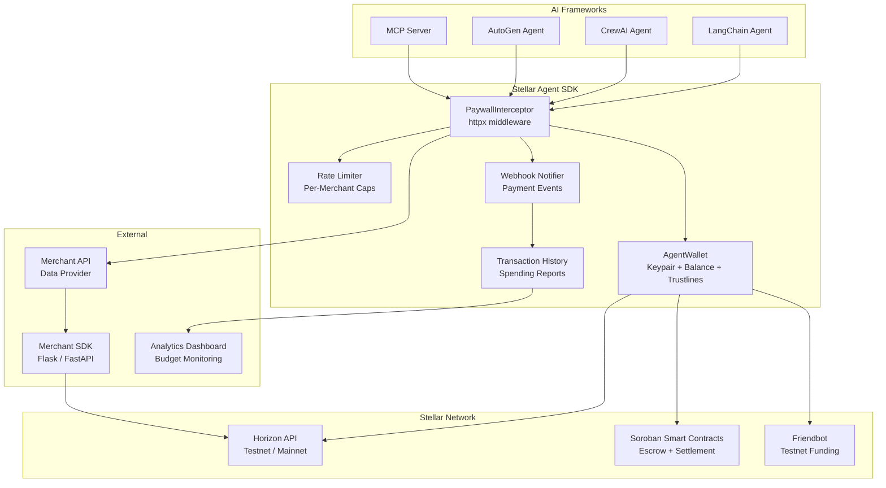
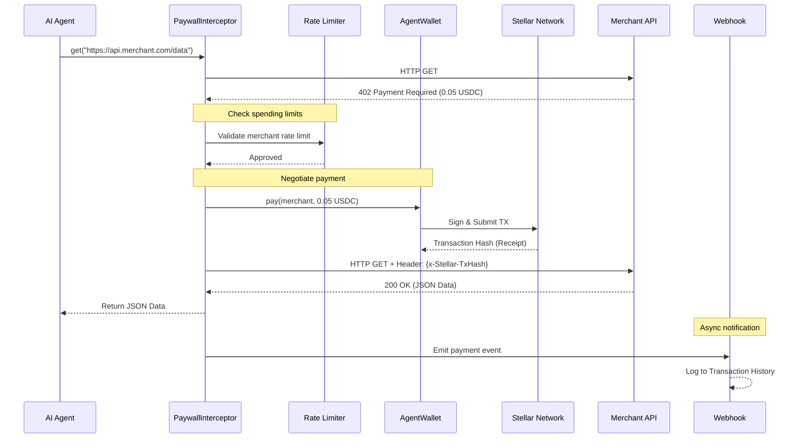
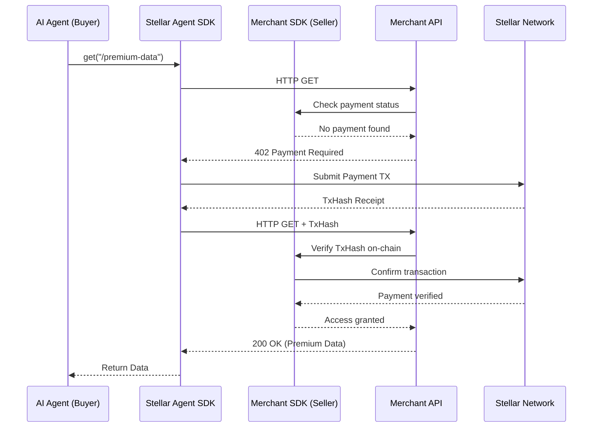

# Stellar Agent SDK


[](https://opensource.org/licenses/MIT)
[](https://www.python.org/downloads/)
[](https://stellar.org/)
[](https://github.com/StellarAgentic/stellar-agent-sdk/issues)

> 🌟 **Actively seeking contributors!** We're building critical infrastructure for the Stellar ecosystem and need help from developers of all skill levels. Check out our [open issues](https://github.com/StellarAgentic/stellar-agent-sdk/issues) to get started.

> **Giving autonomous robots their own bank accounts.**
>
> Agentic commerce infrastructure for Stellar: Give your AI agents a programmable wallet in two lines of code to negotiate, pay, and settle machine-to-machine transactions instantly.

## 🚀 Quickstart

Here is how easy it is to give your AI agent financial autonomy:

```python
from stellar_agent_sdk import AgentWallet, PaywallInterceptor

# 1. Initialize your agent's autonomous wallet
wallet = AgentWallet.from_secret("S_YOUR_SECRET_KEY") 

# 2. Attach the x402 interceptor (allows the agent to auto-pay up to 10 USDC)
client = PaywallInterceptor(wallet=wallet, max_spend_usdc=10.0)

# 3. The agent accesses a paid API. The SDK handles the micro-payment under the hood!
response = client.get("https://api.data-merchant.com/premium-data")
print(response.json())
```

## Why This Exists (The Problem & Solution)

### The Problem: AI Agents have no bank accounts
AI agents are becoming incredibly autonomous, but they hit a brick wall when interacting with the real world: they cannot hold credit cards or pass KYC checks to pay for premium APIs, data sets, or computation. Currently, if an AI agent hits a paywall, it crashes.

### The Solution: A Two-Sided Agentic Economy
We are building the foundational infrastructure for **Agentic Commerce** on Stellar. This goes beyond a simple Python wrapper:

1. **The Buyer (Phase 1):** The `stellar-agent-sdk` bridges the immediate gap. By leveraging the speed and low fees of the Stellar network, this SDK allows any AI agent to spin up a programmable crypto wallet instantly and execute x402 micro-payments autonomously.
2. **The Seller (Phase 2):** A drop-in Merchant SDK for data providers to easily accept agent payments without dealing with fiat gateways or invoicing.
3. **The Marketplace (Phase 3):** A public registry where agents can dynamically discover APIs, negotiate prices, and pay cross-chain, turning Stellar into the definitive settlement layer for the AI economy.

## 🏗️ Architecture (How it Works)

### 🌐 System Overview

The SDK is a modular Python library with distinct layers that handle wallet management, payment negotiation, and framework integrations.



### 💸 Payment Flow (Core Sequence)

The SDK intercepts API requests that require payment (402 errors), pays the merchant automatically via the Stellar network, and retries the request with the payment receipt.



### 🏪 Merchant Integration Flow

For data providers who want to accept agent payments using the Merchant SDK.



## ✨ Key Features

### 🤖 For AI Developers
* **Two-line setup** — Initialize a wallet and start paying for APIs in seconds
* **Non-custodial** — The SDK never stores or transmits your Secret Key; signing happens locally
* **Automatic 402 handling** — The PaywallInterceptor catches payment errors and resolves them without the agent knowing
* **Spending limits** — Set a `max_spend_usdc` cap so your agent can never overspend
* **Testnet-first development** — Build and test with free fake money before going live
* **Framework agnostic** — Works with LangChain, CrewAI, AutoGen, or any Python-based agent
* **Friendbot integration** — Auto-fund Testnet wallets for instant development setup

### 📊 For Data Merchants
* **Instant settlement** — Payments arrive in ~5 seconds on Stellar (vs. days on traditional rails)
* **Micro-transaction friendly** — Charge $0.001 per API call with negligible fees
* **Cryptographic receipts** — Every payment is verified on-chain via Transaction Hash
* **Zero infrastructure** — No payment gateway, no Stripe dashboard, no invoicing. Just a Stellar address

### ⚙️ Core Architecture
* **Built on `httpx` middleware** — Drop-in compatible with any existing Python HTTP workflow
* **Stellar Horizon integration** — Real-time balance queries, transaction monitoring, and account management
* **Environment-aware** — Seamlessly switch between Testnet and Mainnet with a single config change
* **Async-ready** — Designed for concurrent agents running multiple requests simultaneously

---

## 💻 Technology Stack

### 🛠️ Core SDK (Phase 1)
| Layer | Technology | Why |
|-------|-----------|-----|
| **Language** | Python 3.10+ | Where 99% of AI agents live |
| **HTTP Client** | `httpx` | Modern async HTTP with middleware support |
| **Blockchain SDK** | `stellar-sdk` | Official Stellar Python library for Horizon API |
| **Package Manager** | `uv` | Lightning-fast dependency resolution |
| **Testing** | `pytest` | Industry-standard Python testing |
| **Network** | Stellar Testnet / Mainnet | Sub-5s finality, $0.00001 fees |

### 🔮 Planned Infrastructure (Phases 2 & 3)
| Component | Planned Technology | Purpose |
|-----------|--------------------|---------|
| **Smart Contracts** | Rust (Soroban) | Secure on-chain escrow and settlement logic |
| **Merchant SDK** | FastAPI / Flask | Drop-in middleware for data providers to accept agent payments |
| **Analytics UI** | Next.js / React | Real-time budget monitoring and transaction history dashboard |
| **Cross-Chain** | Circle CCTP | Native USDC bridging to Ethereum L2s and Solana |

---

## 🗺️ Roadmap

### 🏗️ Phase 1: Core Infrastructure *(Current — Weeks 1-2)*
- [x] Project scaffolding with `uv`
- [x] `AgentWallet` class (Keypair management, balance queries)
- [ ] `PaywallInterceptor` middleware (402 detection, auto-retry)
- [ ] Automatic Testnet funding via Friendbot integration
- [ ] CLI tool: `stellar-agent fund` to top up an agent wallet from the terminal
- [ ] End-to-end demo on Stellar Testnet
- [ ] Unit test suite with `pytest`

### 🚀 Phase 2: Production Features *(Weeks 3-4)*
- [ ] USDC Trustline auto-establishment
- [ ] Soroban smart contract integration for escrow payments
- [ ] LangChain / OpenAI agent integration wrappers
- [ ] Webhook notifications when an agent makes a payment
- [ ] Transaction history and spending reports per agent
- [ ] Rate-limiting per merchant (prevent runaway spending)
- [ ] Robust error handling (insufficient funds, network timeouts)

### 🌱 Phase 3: Ecosystem Growth *(Months 2-3)*
- [ ] MCP (Model Context Protocol) server so AI agents can discover the SDK as a tool
- [ ] Pre-built Merchant SDK (Flask/FastAPI middleware to accept agent payments)
- [ ] Agent Marketplace — merchants list paid APIs, agents discover them automatically
- [ ] Multi-chain support (Ethereum L2s via bridges)
- [ ] Spending Analytics Dashboard for real-time budget monitoring
- [ ] Documentation site with interactive API playground
- [ ] Community bounty program for new integrations

> For full technical details, see the [Product Requirements Document (PRD)](./PRD.md).

---

## 🤝 Contributing (We love PRs!)

We want to make it ridiculously easy for you to build on top of `stellar-agent-sdk`. We use `uv` for lightning-fast Python package management.

### 🛠️ Local Setup

1. **Clone the repository:**
   ```bash
   git clone https://github.com/StellarAgentic/stellar-agent-sdk.git
   cd stellar-agent-sdk
   ```

2. **Sync dependencies:**
   *(This automatically creates a virtual environment and installs everything you need)*
   ```bash
   uv sync
   ```

3. **Run the tests:**
   ```bash
   uv run pytest
   ```

Check out our issues tab for `good first issue` tags. If you fix one, you might just be eligible for a GrantFox/Drips bounty!
