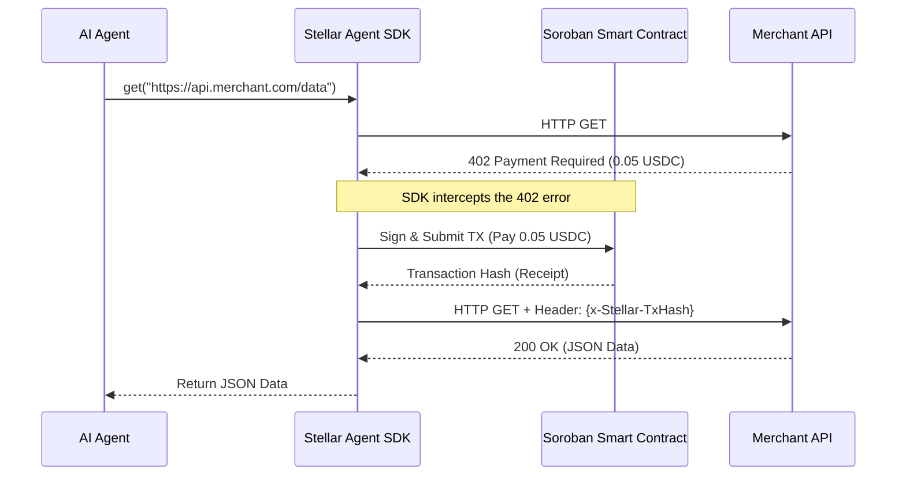

# Stellar Agent SDK 🤖

> **Giving autonomous robots their own bank accounts.**
>
> Agentic commerce infrastructure for Stellar: Give your AI agents a programmable Soroban wallet in two lines of code to negotiate, pay, and settle machine-to-machine transactions instantly.

## 🚀 Quickstart

Here is how easy it is to give your AI agent financial autonomy:

```python
from stellar_agent_sdk import AgentWallet, PaywallInterceptor

# 1. Initialize your agent's autonomous Soroban wallet
wallet = AgentWallet.from_secret("S_YOUR_SECRET_KEY") 

# 2. Attach the x402 interceptor (allows the agent to auto-pay up to 10 USDC)
client = PaywallInterceptor(wallet=wallet, max_spend_usdc=10.0)

# 3. The agent accesses a paid API. The SDK handles the micro-payment under the hood!
response = client.get("https://api.data-merchant.com/premium-data")
print(response.json())
```

## 💥 Why This Exists (The Problem & Solution)

### The Problem: AI Agents have no bank accounts
AI agents are becoming incredibly autonomous, but they hit a brick wall when interacting with the real world: they cannot hold credit cards or pass KYC checks to pay for premium APIs, data sets, or computation. 

### The Solution: Soroban + x402
The `stellar-agent-sdk` bridges this gap. By leveraging the speed and low fees of the Stellar Soroban network, this SDK allows any AI agent to spin up a programmable crypto wallet instantly. Combined with the x402 HTTP Payment protocol, agents can now negotiate and execute micro-payments for APIs on a strict, pay-as-you-go basis—entirely autonomously.

## 🧠 Architecture (How it Works)

The SDK intercepts API requests that require payment (402 errors), pays the merchant automatically via a Soroban smart contract, and retries the request with the payment receipt.



## 🤝 Contributing (We love PRs!)

We want to make it ridiculously easy for you to build on top of `stellar-agent-sdk`. We use `uv` for lightning-fast Python package management.

### Local Setup

1. **Clone the repository:**
   ```bash
   git clone https://github.com/StellarAgentic/stellar-agent-sdk.git
   cd stellar-agent-sdk
   ```

2. **Sync dependencies:**
   *(This automatically creates a virtual environment and installs everything you need)*
   ```bash
   uv sync
   ```

3. **Run the tests:**
   ```bash
   uv run pytest
   ```

Check out our issues tab for `good first issue` tags. If you fix one, you might just be eligible for a GrantFox/Drips bounty!
